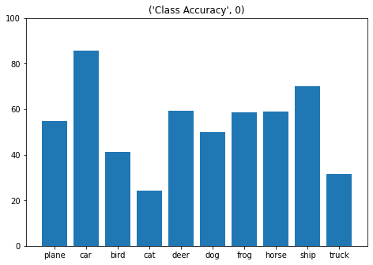
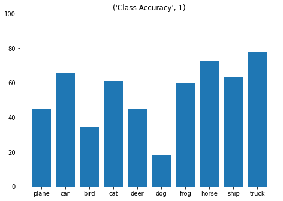
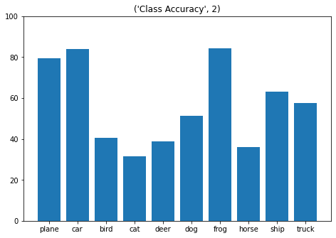
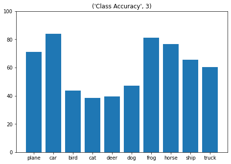
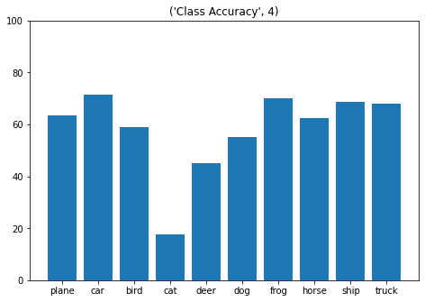
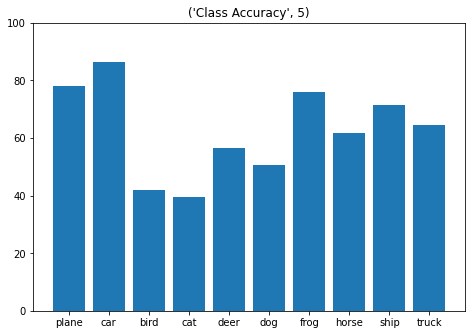
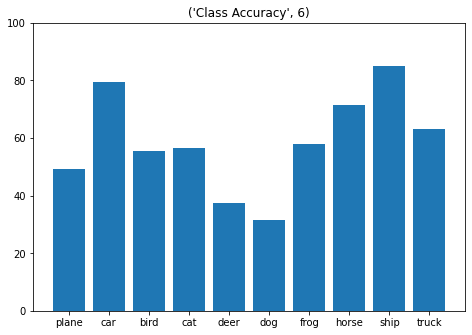

[Jupyter Notebook:](https://colab.research.google.com/drive/1H4CMCkfj26ieoxvXJCfVlNSjN2p8ptBy?usp=sharing)

Initial score: 53.44

Improved score: 62.73

# Introduction

The challenge for this task was to improve upon the average accuracy of a CIFAR-10 image classifier, using the official PyTorch CIFAR-10 tutorial as a starting point: https://pytorch.org/tutorials/beginner/blitz/cifar10_tutorial.html#sphx-glr-beginner-blitz-cifar10-tutorial-py

In order to try and improve accuracy, I experimented with various hyperparameters, particulary conv2d shape and number of layers.

The majority of this post consists of code and associated graphs. **For a write-up of the experiments performed, contributions, and final results, please scroll to the bottom for "Analysis".**

# Set-up

*   Loaded and normalised CIFAR10 training/test datasets using torchvision
*   Set up two lists "networkAcc" and "classAcc" to record results across experiments


```
import torch
import torchvision
import torchvision.transforms as transforms

transform = transforms.Compose(
    [transforms.ToTensor(),
     transforms.Normalize((0.5, 0.5, 0.5), (0.5, 0.5, 0.5))])

trainset = torchvision.datasets.CIFAR10(root='./data', train=True,
                                        download=True, transform=transform)
trainloader = torch.utils.data.DataLoader(trainset, batch_size=4,
                                          shuffle=True, num_workers=2)

testset = torchvision.datasets.CIFAR10(root='./data', train=False,
                                       download=True, transform=transform)
testloader = torch.utils.data.DataLoader(testset, batch_size=4,
                                         shuffle=False, num_workers=2)

classes = ('plane', 'car', 'bird', 'cat',
           'deer', 'dog', 'frog', 'horse', 'ship', 'truck')
```

    Files already downloaded and verified
    Files already downloaded and verified
    


```
#save results/clear results
networkAcc = []
classAcc = []
```

# Build ConvNet


```
import torch.nn as nn
import torch.nn.functional as F


class Net(nn.Module):
    def __init__(self):
        super(Net, self).__init__()
        #Conv2d(inchannels, outchannels(matter of pref), kernels)

        #base, run0
        # self.conv1 = nn.Conv2d(3, 6, 5)
        # self.pool = nn.MaxPool2d(2, 2)
        # self.conv2 = nn.Conv2d(6, 16, 5)
        # self.fc1 = nn.Linear(16 * 5 * 5, 120)
        # self.fc2 = nn.Linear(120, 84)
        # self.fc3 = nn.Linear(84, 10)

        #run1
        # self.conv1 = nn.Conv2d(3, 16, 5)
        # self.pool = nn.MaxPool2d(2, 2)
        # self.conv2 = nn.Conv2d(16, 16, 5)
        # self.fc1 = nn.Linear(16 * 5 * 5, 120)
        # self.fc2 = nn.Linear(120, 84)
        # self.fc3 = nn.Linear(84, 10)

        #run2
        # self.conv1 = nn.Conv2d(3, 32, 5)
        # self.pool = nn.MaxPool2d(2, 2)
        # self.conv2 = nn.Conv2d(32, 16, 5)
        # self.fc1 = nn.Linear(16 * 5 * 5, 120)
        # self.fc2 = nn.Linear(120, 84)
        # self.fc3 = nn.Linear(84, 10)

        #run3
        # self.conv1 = nn.Conv2d(3, 128, 5)
        # self.pool = nn.MaxPool2d(2, 2)
        # self.conv2 = nn.Conv2d(128, 16, 5)
        # self.fc1 = nn.Linear(16 * 5 * 5, 120)
        # self.fc2 = nn.Linear(120, 84)
        # self.fc3 = nn.Linear(84, 10)

        #run4
        # self.conv1 = nn.Conv2d(3, 6, 5)
        # self.pool = nn.MaxPool2d(2, 2)
        # self.conv2 = nn.Conv2d(6, 16, 5)
        # self.fc1 = nn.Linear(16 * 5 * 5, 120)
        # self.fc2 = nn.Linear(120, 84)
        # self.fc3 = nn.Linear(84, 10)

        # self.conv1 = nn.Conv2d(3, 16, 5)
        # self.pool = nn.MaxPool2d(2, 2)
        # self.conv2 = nn.Conv2d(16, 16, 5)
        # self.fc1 = nn.Linear(16 * 5 * 5, 120)
        # self.fc2 = nn.Linear(120, 84)
        # self.fc3 = nn.Linear(84, 10)

        #run5
        # self.conv1 = nn.Conv2d(3, 6, 5)
        # self.pool = nn.MaxPool2d(2, 2)
        # self.conv2 = nn.Conv2d(6, 16, 5)
        # self.fc1 = nn.Linear(16 * 5 * 5, 120)
        # self.fc2 = nn.Linear(120, 84)
        # self.fc3 = nn.Linear(84, 10)

        # self.conv1 = nn.Conv2d(3, 16, 5)
        # self.pool = nn.MaxPool2d(2, 2)
        # self.conv2 = nn.Conv2d(16, 16, 5)
        # self.fc1 = nn.Linear(16 * 5 * 5, 120)
        # self.fc2 = nn.Linear(120, 84)
        # self.fc3 = nn.Linear(84, 10)

        # self.conv1 = nn.Conv2d(3, 128, 5)
        # self.pool = nn.MaxPool2d(2, 2)
        # self.conv2 = nn.Conv2d(128, 16, 5)
        # self.fc1 = nn.Linear(16 * 5 * 5, 120)
        # self.fc2 = nn.Linear(120, 84)
        # self.fc3 = nn.Linear(84, 10)

        #run6
        self.conv1 = nn.Conv2d(3, 128, 5)
        self.pool = nn.MaxPool2d(2, 2)
        self.conv2 = nn.Conv2d(128, 16, 5)
        self.fc1 = nn.Linear(16 * 5 * 5, 120)
        self.fc2 = nn.Linear(120, 84)
        self.fc3 = nn.Linear(84, 10)

        self.conv1 = nn.Conv2d(3, 128, 5)
        self.pool = nn.MaxPool2d(2, 2)
        self.conv2 = nn.Conv2d(128, 16, 5)
        self.fc1 = nn.Linear(16 * 5 * 5, 120)
        self.fc2 = nn.Linear(120, 84)
        self.fc3 = nn.Linear(84, 10)


    def forward(self, x):
        x = self.pool(F.relu(self.conv1(x)))
        x = self.pool(F.relu(self.conv2(x)))
        x = x.view(-1, 16 * 5 * 5)
        x = F.relu(self.fc1(x))
        x = F.relu(self.fc2(x))
        x = self.fc3(x)
        return x


net = Net()

import torch.optim as optim

criterion = nn.CrossEntropyLoss()
optimiser = optim.SGD(net.parameters(), lr=0.001, momentum=0.9)
```

# Training


```
net = Net()

import torch.optim as optim

criterion = nn.CrossEntropyLoss()
optimiser = optim.SGD(net.parameters(), lr=0.001, momentum=0.9)

for epoch in range(2):

    running_loss = 0.0
    for i, data in enumerate(trainloader, 0):
        inputs, labels = data

        optimiser.zero_grad()

        outputs = net(inputs)
        loss = criterion(outputs, labels)
        loss.backward()
        optimiser.step()

        running_loss += loss.item()
        if i % 2000 == 1999: 
            print('[%d, %5d] loss: %.3f' %
                  (epoch + 1, i + 1, running_loss / 2000))
            running_loss = 0.0

print('Finished Training')
```

    [1,  2000] loss: 2.051
    [1,  4000] loss: 1.695
    [1,  6000] loss: 1.580
    [1,  8000] loss: 1.471
    [1, 10000] loss: 1.386
    [1, 12000] loss: 1.354
    [2,  2000] loss: 1.261
    [2,  4000] loss: 1.265
    [2,  6000] loss: 1.215
    [2,  8000] loss: 1.186
    [2, 10000] loss: 1.160
    [2, 12000] loss: 1.136
    Finished Training
    


```
PATH = './cifar_net.pth'
torch.save(net.state_dict(), PATH)
```

# Testing


```
correct = 0
total = 0
with torch.no_grad():
    for data in testloader:
        images, labels = data
        outputs = net(images)
        _, predicted = torch.max(outputs.data, 1)
        total += labels.size(0)
        correct += (predicted == labels).sum().item()
        percentage = (correct/total)*100

print('Accuracy of the network on the 10000 test images: %d %%' % (
    percentage))

networkAcc.append(percentage)

classTemp = []

class_correct = list(0. for i in range(10))
class_total = list(0. for i in range(10))
with torch.no_grad():
    for data in testloader:
        images, labels = data
        outputs = net(images)
        _, predicted = torch.max(outputs, 1)
        c = (predicted == labels).squeeze()
        for i in range(4):
            label = labels[i]
            class_correct[label] += c[i].item()
            class_total[label] += 1


for i in range(10):
  classPerc = 100 * class_correct[i] / class_total[i]
  print('Accuracy of %5s : %2d %%' % (
        classes[i], classPerc))
  classTemp.append(classPerc)

classAcc.append(classTemp)
```

    Accuracy of the network on the 10000 test images: 58 %
    Accuracy of plane : 49 %
    Accuracy of   car : 79 %
    Accuracy of  bird : 55 %
    Accuracy of   cat : 56 %
    Accuracy of  deer : 37 %
    Accuracy of   dog : 31 %
    Accuracy of  frog : 58 %
    Accuracy of horse : 71 %
    Accuracy of  ship : 85 %
    Accuracy of truck : 63 %
    

# Results


```
import matplotlib.pyplot as plt

#print(networkAcc)
print("Overall Accuracy:")
for i in range(len(networkAcc)):
  if i == 0:
    print("[Base]: ", networkAcc[0])
  else:
    print("[",i,"]: %.2f" %networkAcc[i])

improve = max(networkAcc) - networkAcc[0]
print("Improvement: %.2f" %improve)

plt.plot(networkAcc)
plt.title("Overall Accuracy")
plt.xlabel("Run#")
plt.ylim([0,100])
plt.show()

classes = ['plane', 'car', 'bird', 'cat',
           'deer', 'dog', 'frog', 'horse', 'ship', 'truck']
for i in range(len(classAcc)):
  fig = plt.figure()
  ax = fig.add_axes([0,0,1,1])
  ax.bar(classes, classAcc[i])
  plt.ylim([0,100])
  tempTitle = "Class Accuracy", i
  plt.title(tempTitle)
  plt.show()

```

    Overall Accuracy:
    [Base]:  53.44
    [ 1 ]: 54.17
    [ 2 ]: 56.63
    [ 3 ]: 60.77
    [ 4 ]: 58.09
    [ 5 ]: 62.73
    [ 6 ]: 58.73
    Improvement: 9.29
    























# Analysis

Experiments involved:

*   Runs 1-3: changed the shape of conv2d. Resulted in a 7% increase in overall network accuracy, but some class accuracy decreased while others increased.

*   Runs 4-5: using the different conv2d shapes from 1-3, added them on as additional layers. The intent was to go up to 4 layers total, but as the accuracy began to flunctuate, and the training time became noticeably longer, this did not seem the best way forward.

In the end, I was able to improve upon the base accuracy by 9.29%.


# References


*   "Training a Classifier", https://pytorch.org/tutorials/beginner/blitz/cifar10_tutorial.html#sphx-glr-beginner-blitz-cifar10-tutorial-py
*   Swanand Mhalagi, "The Quest of Higher Accuracy for CNN Models", https://towardsdatascience.com/the-quest-of-higher-accuracy-for-cnn-models-42df5d731faf


