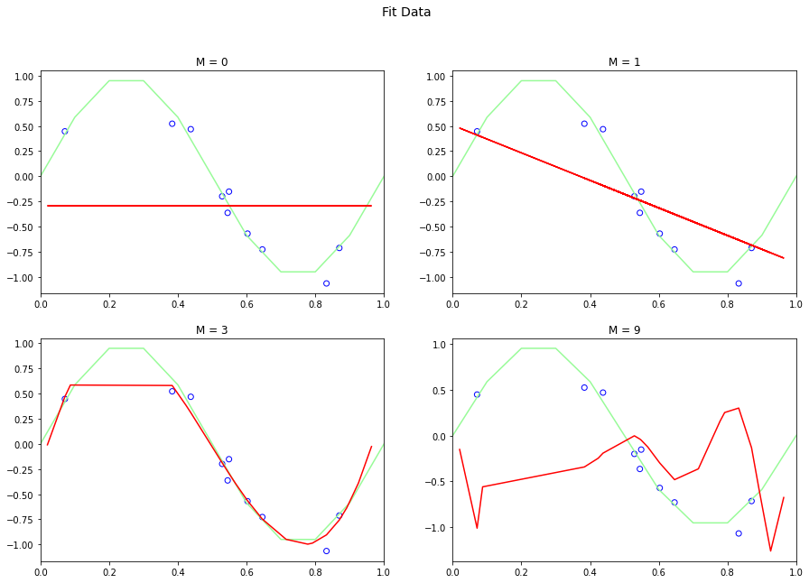
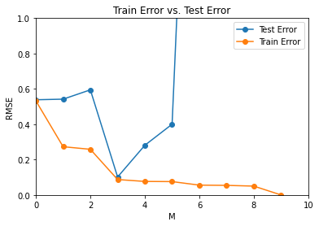
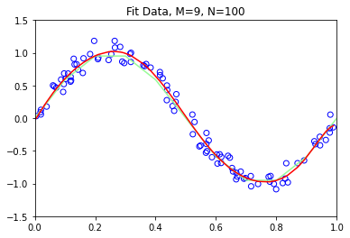
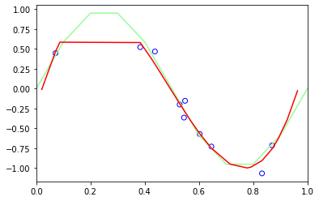
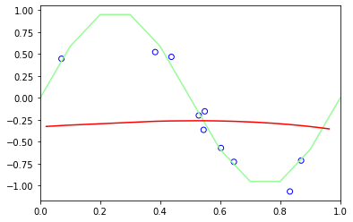
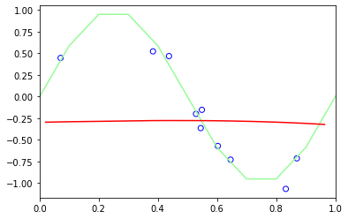
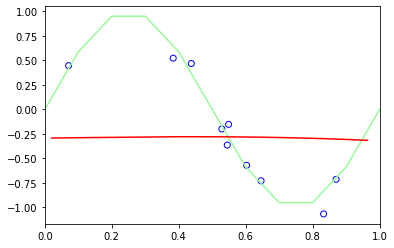
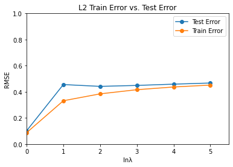

# Introduction

Blog homepage: https://1040mxg.github.io/blog/
Jupyter notebook: https://colab.research.google.com/drive/1UUgFzRcev7eYsX0-19o8WJqCl4GiWVNH?usp=sharing

The goal of this exercise is to learn about the concept of overfitting using higher order linear regression, and find the best model for performance.

**Overfitting** and **Underfitting** are both performance-affecting deficiencies that may affect machine learning models. In overfitting, the model leads to a result that is more complex than necessary. It picks up on irrelevant noise and detail in a way that affects how the model performs on test data. When a model is overfitted, it performs well on training data but has trouble when applied to new test data, and will perform poorly.

Underfitting occurs when the model is too simple, and performs poorly on both training and test data. 

# Data Generation

Generate 20 data pairs (X, Y) using y = sin(2*pi*X) + 0.1 * N

*   Use uniform distribution between 0 and 1 for X
*   Sample N from the normal gaussian distribution 
*   Use 10 for train and 10 for test 


```python
import numpy as np
import math
from numpy import random
from sklearn.model_selection import train_test_split

random.seed(0)
x_data = random.uniform(size=20)
y_data = np.sin(2*math.pi*x_data) + .1*random.normal(size=20)

x_train, x_test, y_train, y_test = train_test_split(x_data, y_data, train_size=10)

print("{{Training Pairs}}")
for i in range(10):
  print("(%.5f, %.5f)" %(x_train[i], y_train[i]))
print("\n")
print("{{Testing Pairs}}")
for i in range(10):
  print("(%.5f, %.5f)" %(x_test[i], y_test[i]))
```

    {{Training Pairs}}
    (0.38344, 0.52319)
    (0.64589, -0.72822)
    (0.87001, -0.71328)
    (0.54881, -0.15251)
    (0.83262, -1.06634)
    (0.60276, -0.57044)
    (0.07104, 0.44716)
    (0.52889, -0.19927)
    (0.43759, 0.46862)
    (0.54488, -0.36370)
    
    
    {{Testing Pairs}}
    (0.71519, -0.99669)
    (0.08713, 0.55833)
    (0.02022, 0.03792)
    (0.92560, -0.30371)
    (0.56804, -0.26135)
    (0.89177, -0.70302)
    (0.96366, 0.00064)
    (0.77816, -1.01918)
    (0.79173, -0.96125)
    (0.42365, 0.20621)
    

# Find weights & fit

To determine the weight values, I first set up a polynomial function for fitting and a loss function for training. Then I generated n+1 random numbers to initialise the $w_{n}$ parameters, where n is the degree of the polynomial. In other words, a degree 0 polynomial would generate 1 initialised number for $w_{0}$, a degree 1 would generate 2 for $w_{0}$ and $w_{1}$, and so on.

Then, optimal parameters are decided using a least squares method with the initalised values and the loss function.

The fit data was then graphed for degree values $M$ = 0, 1, 3, and 9.


```python
import numpy as np
import math
from numpy import random
from sklearn.model_selection import train_test_split
import matplotlib.pyplot as plt
import operator
from tabulate import tabulate
from scipy.optimize import leastsq

random.seed(0)
x_data = random.uniform(size=20)
y_data = np.sin(2*math.pi*x_data) + .1*random.normal(size=20)

x_train, x_test, y_train, y_test = train_test_split(x_data, y_data, train_size=10)

x = x_data.copy()
y = y_data.copy()

x2 = x_data.copy()
y2 = y_data.copy()

x_train = np.array(x_train).reshape(len(x_train),1)
y_train = np.array(y_train).reshape(len(y_train),1)

parameters = []
yPred = []

def fit_func(p, x):
  f = np.poly1d(p)
  #returns a poly function starting with greatest degree => degree 0
  return f(x)

def err_func(p, x, y):
  ret = fit_func(p, x) - y
  return ret

def n_poly(n):
  p_init = random.randn(n+1)
  param = leastsq(err_func, p_init, args=(np.array(x), np.array(y)))
  parameters.append(param[0])
  return param[0]

y_pred_0 = fit_func(n_poly(0), x)
y_pred_1 = fit_func(n_poly(1), x)
y_pred_3 = fit_func(n_poly(3), x)
y_pred_9 = fit_func(n_poly(9), x)

table = [['w','M=0','M=1','M=3','M=9',],
         [parameters[0][0], parameters[1][-1], parameters[2][-1], parameters[3][-1]],
         ['', parameters[1][-2], parameters[2][-2], parameters[3][-2]],
         ['', '', parameters[2][-3], parameters[3][-3]],
         ['', '', parameters[2][-4], parameters[3][-4]],
         ['', '', '', parameters[3][-5]],
         ['', '', '', parameters[3][-6]],
         ['', '', '', parameters[3][-7]],
         ['', '', '', parameters[3][-8]],
         ['', '', '', parameters[3][-9]],
         ['', '', '', parameters[3][0]],
         ]

print("{Weight Table}",)
print(tabulate(table, headers='firstrow', tablefmt='fancy_grid', showindex=True, numalign='right', floatfmt=('.2f')))

print("\n")

fig, axes = plt.subplots(2, 2, figsize=(15,10))
fig.suptitle("Fit Data", fontsize=14)

# #plot the model sine fit
sinX = np.arange(0,4*np.pi,0.1)
sinY = np.sin(2*math.pi*sinX)
axes[0,0].set_xlim([0,1])
axes[0,0].plot(sinX, sinY, 'palegreen')
axes[0,0].plot(x, y_pred_0, 'r')
axes[0,0].scatter(x_train, y_train, facecolors='none', edgecolors='b', label="Training Set")
axes[0,0].set_title("M = 0")

sinX = np.arange(0,4*np.pi,0.1)
sinY = np.sin(2*math.pi*sinX)
axes[0,1].set_xlim([0,1])
axes[0,1].plot(sinX, sinY, 'palegreen')
axes[0,1].plot(x, y_pred_1, 'r')
axes[0,1].scatter(x_train, y_train, facecolors='none', edgecolors='b', label="Training Set")
axes[0,1].set_title("M = 1")

sinX = np.arange(0,4*np.pi,0.1)
sinY = np.sin(2*math.pi*sinX)
axes[1,0].set_xlim([0,1])
axes[1,0].plot(sinX, sinY, 'palegreen')
sort_axis = operator.itemgetter(0)
sorted_zip = sorted(zip(x,y_pred_3), key=sort_axis)
x, y_pred_3 = zip(*sorted_zip)
axes[1,0].plot(sorted(x), y_pred_3, 'r')
axes[1,0].scatter(x_train, y_train, facecolors='none', edgecolors='b', label="Training Set")
axes[1,0].set_title("M = 3")

#######

sinX = np.arange(0,4*np.pi,0.1)
sinY = np.sin(2*math.pi*sinX)
axes[1,1].set_xlim([0,1])
axes[1,1].plot(sinX, sinY, 'palegreen')

x = np.array(x).reshape(len(x),1)
y = np.array(y).reshape(len(y),1)

polynomial_features= PolynomialFeatures(degree=9)
x_poly = polynomial_features.fit_transform(x)

model = LinearRegression()
model.fit(x_poly, y)
y_poly_pred = model.predict(x_poly)

#sort x for smooth plotting
sort_axis = operator.itemgetter(0)
sorted_zip = sorted(zip(x,y_poly_pred), key=sort_axis)
x, y_poly_pred = zip(*sorted_zip)
axes[1,1].plot(x, y_poly_pred, 'r')
axes[1,1].scatter(x_train, y_train, facecolors='none', edgecolors='b', label="Training Set")
axes[1,1].set_title("M = 9")
plt.show()
```

    {Weight Table}
    ╒═════╤═══════════════════╤════════════════════╤══════════════════════╤═══════════╕
    │   w │ M=0               │ M=1                │ M=3                  │       M=9 │
    ╞═════╪═══════════════════╪════════════════════╪══════════════════════╪═══════════╡
    │   0 │ -0.28984580821873 │ 0.5073985691013673 │ -0.24901343596489345 │      0.01 │
    ├─────┼───────────────────┼────────────────────┼──────────────────────┼───────────┤
    │   1 │                   │ -1.370884298401796 │ 12.585180143885092   │     -2.81 │
    ├─────┼───────────────────┼────────────────────┼──────────────────────┼───────────┤
    │   2 │                   │                    │ -36.66398954400864   │    273.38 │
    ├─────┼───────────────────┼────────────────────┼──────────────────────┼───────────┤
    │   3 │                   │                    │ 24.743232892335847   │  -2919.38 │
    ├─────┼───────────────────┼────────────────────┼──────────────────────┼───────────┤
    │   4 │                   │                    │                      │  14480.21 │
    ├─────┼───────────────────┼────────────────────┼──────────────────────┼───────────┤
    │   5 │                   │                    │                      │ -40396.82 │
    ├─────┼───────────────────┼────────────────────┼──────────────────────┼───────────┤
    │   6 │                   │                    │                      │  66763.20 │
    ├─────┼───────────────────┼────────────────────┼──────────────────────┼───────────┤
    │   7 │                   │                    │                      │ -64885.02 │
    ├─────┼───────────────────┼────────────────────┼──────────────────────┼───────────┤
    │   8 │                   │                    │                      │  34303.10 │
    ├─────┼───────────────────┼────────────────────┼──────────────────────┼───────────┤
    │   9 │                   │                    │                      │  -7615.89 │
    ╘═════╧═══════════════════╧════════════════════╧══════════════════════╧═══════════╛
    
    
    





# Train & Test Error

The model was then evaluted using RMSE-- root mean square error. y-values were predicted using a polynomial regression model with both the training and test data.

The training and test errors were near identical at $M=0$ and $M=3$, before drastically diverging, with the test error reaching six digits while the training error went to zero.


```python
import numpy as np
import math
from numpy import random
from sklearn.model_selection import train_test_split
from sklearn.linear_model import LinearRegression
from sklearn.preprocessing import PolynomialFeatures
from sklearn.metrics import mean_squared_error
import matplotlib.pyplot as plt

random.seed(0)
x_data = random.uniform(size=20)
y_data = np.sin(2*math.pi*x_data) + .1*random.normal(size=20)

x_train, x_test, y_train, y_test = train_test_split(x_data, y_data, train_size=10)

x_train = np.array(x_train).reshape(len(x_train),1)
y_train = np.array(y_train).reshape(len(y_train),1)
x_test = np.array(x_test).reshape(len(x_test),1)
y_test = np.array(y_test).reshape(len(y_test),1)

rmseTest = []
rmseTrain = []

for i in range(10):
  poly_features = PolynomialFeatures(degree=i)
  x_train_poly = poly_features.fit_transform(x_train)
  poly_model = LinearRegression()
  poly_model.fit(x_train_poly, y_train)

  y_train_pred = poly_model.predict(x_train_poly)
  y_test_pred = poly_model.predict(poly_features.fit_transform(x_test))

  rmse_train = np.sqrt(mean_squared_error(y_train, y_train_pred))
  rmse_test = np.sqrt(mean_squared_error(y_test, y_test_pred))
  
  rmseTrain.append(rmse_train)
  rmseTest.append(rmse_test)

print("--------------------------------")
print("---Train Error vs. Test Error---")
print("--------------------------------")
for i in range(len(rmseTrain)):
  print("M=",i, "| [%.4f]----------[%.4f]" %(rmseTrain[i], rmseTest[i]))
print("\n")
  
plt1 = plt.plot(rmseTest, marker='o', label="Test Error")
plt.plot(rmseTrain, marker='o', label="Train Error")
plt.legend()
plt.xlim([0,10])
plt.ylim([0,1])
plt.xlabel("M")
plt.ylabel("RMSE")
plt.title("Train Error vs. Test Error")
plt.show(plt1)


```

    --------------------------------
    ---Train Error vs. Test Error---
    --------------------------------
    M= 0 | [0.5325]----------[0.5385]
    M= 1 | [0.2730]----------[0.5419]
    M= 2 | [0.2582]----------[0.5946]
    M= 3 | [0.0872]----------[0.1015]
    M= 4 | [0.0765]----------[0.2810]
    M= 5 | [0.0755]----------[0.4001]
    M= 6 | [0.0555]----------[3.9055]
    M= 7 | [0.0542]----------[11.5431]
    M= 8 | [0.0500]----------[319.6938]
    M= 9 | [0.0000]----------[123929.9902]
    
    
    





# Data Generation II

Using the same methods as Data Generation I, 100 data points are generated and fit to a ninth-order model.


```python
import numpy as np
import math
from numpy import random
from sklearn.model_selection import train_test_split
import matplotlib.pyplot as plt
import operator
from tabulate import tabulate
from scipy.optimize import leastsq

random.seed(0)
x_data = random.uniform(size=100)
y_data = np.sin(2*math.pi*x_data) + .1*random.normal(size=100)

print("{{Sample Data}}")
for i in range(5):
  print("(%.5f, %.5f)" %(x_data[i], y_data[i]))
print("\n")

plt.title("Fit Data, M=9, N=100")
plt.scatter(x_data, y_data, facecolors='none', edgecolors='b')

sinX = np.arange(0,4*np.pi,0.1)
sinY = np.sin(2*math.pi*sinX)
plt.xlim([0,1])
plt.ylim([-1.5, 1.5])
plt.plot(sinX, sinY, 'palegreen')

x_data = np.array(x_data).reshape(len(x_data),1)
y_data = np.array(y_data).reshape(len(y_data),1)

polynomial_features= PolynomialFeatures(degree=9)
x_poly = polynomial_features.fit_transform(x_data)

model = LinearRegression()
model.fit(x_poly, y_data)
y_poly_pred = model.predict(x_poly)

#sort x_data for smooth plotting
sort_axis = operator.itemgetter(0)
sorted_zip = sorted(zip(x_data,y_poly_pred), key=sort_axis)
x_data, y_poly_pred = zip(*sorted_zip)
plt.plot(x_data, y_poly_pred, 'r')
plt.show()
```

    {{Sample Data}}
    (0.54881, -0.41843)
    (0.71519, -0.88609)
    (0.60276, -0.55518)
    (0.54488, -0.43191)
    (0.42365, 0.61033)
    
    
    





# Regularisation

The original dataset from Data Generation 1, reproduced below, will be regularised using the sum of weights.

$E(w)=\frac{1}{2}\sum_{n=1}^N \{y(x_n, w) - t_n\}^2 + \frac{\lambda}{2}||w||^2$

This is a solution to overfitting known as regularisation. Regularisation counters overfitting by penalising overly-complex models, minimising loss and complexity. In the above formula, known as "L2 regularisation" or  "ridge regression", the regularisation term is defined as the sum of the the squares of all the feature weights. In this, weights near zero have little effect on model complexity while outliers have great effect. <p><br>
The data will be fitted on polynomial degree 3 and train/test error determined for $\lambda = 1, \frac{1}{10}, \frac{1}{100}, \frac{1}{1000}, \frac{1}{10000},$ and $\frac{1}{100000}$. scikit-learn's Ridge module will be used for the sake of efficiency.
 


```python
import numpy as np
import math
from numpy import random
from sklearn.model_selection import train_test_split
from sklearn.linear_model import LinearRegression
from sklearn.linear_model import Ridge
from sklearn.linear_model import ElasticNet
from sklearn.metrics import mean_squared_error

from sklearn.preprocessing import PolynomialFeatures
from sklearn.pipeline import Pipeline
from sklearn.preprocessing import StandardScaler

random.seed(0)
x_data = random.uniform(size=20)
y_data = np.sin(2*math.pi*x_data) + .1*random.normal(size=20)

x_train, x_test, y_train, y_test = train_test_split(x_data, y_data, train_size=10)

x_train2 = x_train.copy()
y_train2 = y_train.copy()
x_test2 = x_test.copy()
y_test2 = y_test.copy()

x_train = np.array(x_train).reshape(len(x_train),1)
y_train = np.array(y_train).reshape(len(y_train),1)
x_test = np.array(x_test).reshape(len(x_test),1)
y_test = np.array(y_test).reshape(len(y_test),1)

x_train2 = np.array(x_train2).reshape(len(x_train2),1)
y_train2 = np.array(y_train2).reshape(len(y_train2),1)
x_test2 = np.array(x_test2).reshape(len(x_test2),1)
y_test2 = np.array(y_test2).reshape(len(y_test2),1)

x_data = np.array(x_data).reshape(len(x_data),1)
y_data = np.array(y_data).reshape(len(y_data),1)

# print("{{Training Pairs}}")
# for i in range(10):
#   print("(%.5f, %.5f)" %(x_train[i], y_train[i]))
# print("\n")
# print("{{Testing Pairs}}")
# for i in range(10):
#   print("(%.5f, %.5f)" %(x_test[i], y_test[i]))
# print("\n")

###########MODEL#################

#baseline polymodel with linReg model, same as in earlier section

# rmseTest = []
# rmseTrain = []

# for i in range(10):
#   poly_features = PolynomialFeatures(degree=i)
#   x_train_poly = poly_features.fit_transform(x_train)
#   poly_model = LinearRegression()
#   poly_model.fit(x_train_poly, y_train)

#   y_train_pred = poly_model.predict(x_train_poly)
#   y_test_pred = poly_model.predict(poly_features.fit_transform(x_test))

#   rmse_train = np.sqrt(mean_squared_error(y_train, y_train_pred))
#   rmse_test = np.sqrt(mean_squared_error(y_test, y_test_pred))
  
#   rmseTrain.append(rmse_train)
#   rmseTest.append(rmse_test)

# print("--------------------------------")
# print("-Baseline Train vs. Test Error--")
# print("--------------------------------")
# for i in range(len(rmseTrain)):
#   print("M=",i, "| [%.4f]----------[%.4f]" %(rmseTrain[i], rmseTest[i]))
# print("\n")


######PLOTTING################
lamb = [1, 1/10, 1/100, 1/1000, 1/10000, 1/100000]


for l in range(len(lamb)):
  poly_features = PolynomialFeatures(degree=3)
  x_train_l2 = poly_features.fit_transform(x_data)
  l2_model = Ridge(alpha=l, fit_intercept=True)
  l2_model.fit(x_train_l2, y_data)

  y_train_pred_l2 = l2_model.predict(x_train_l2)
  y_test_pred_l2 = l2_model.predict(poly_features.fit_transform(x_test))

  plt1 = plt.gca()

  sinX = np.arange(0,4*np.pi,0.1)
  sinY = np.sin(2*math.pi*sinX)
  plt.plot(sinX, sinY, 'palegreen')
  plt.scatter(x_train, y_train, facecolors='none', edgecolors='b', label="Training Set")

  sort_axis = operator.itemgetter(0)
  sorted_zip = sorted(zip(x_data,y_train_pred_l2), key=sort_axis)
  x_data, y_train_pred_l2 = zip(*sorted_zip)
  plt.plot(sorted(x_data), y_train_pred_l2, 'r')
  plt.xlim([0,1])
  plt.show(plt1)


print("\n")

######L2 REG RMSE############

rmseTest_l2 = []
rmseTrain_l2 = []

for l in range(len(lamb)):
  poly_features = PolynomialFeatures(degree=3)
  x_train_l2 = poly_features.fit_transform(x_train)
  l2_model = Ridge(alpha=l, fit_intercept=True)
  l2_model.fit(x_train_l2, y_train)

  y_train_pred_l2 = l2_model.predict(x_train_l2)
  y_test_pred_l2 = l2_model.predict(poly_features.fit_transform(x_test))

  rmse_train_l2 = np.sqrt(mean_squared_error(y_train, y_train_pred_l2))
  rmse_test_l2 = np.sqrt(mean_squared_error(y_test, y_test_pred_l2))
  
  rmseTrain_l2.append(rmse_train_l2)
  rmseTest_l2.append(rmse_test_l2)

print("--------------------------------")
print("----L2 Train vs. Test Error-----")
print("--------------------------------")
for i in range(len(rmseTrain_l2)):
  print("λe-",i, "| [%.4f]----------[%.4f]" %(rmseTrain_l2[i], rmseTest_l2[i]))
print("\n")

plt2 = plt.plot(rmseTest_l2, marker='o', label="Test Error")
plt.plot(rmseTrain_l2, marker='o', label="Train Error")
plt.legend()
plt.xlim([0,5.5])
plt.ylim([0,1])
plt.xlabel("lnλ")
plt.ylabel("RMSE")
plt.title("L2 Train Error vs. Test Error")
plt.show(plt2)

```














    
    
    --------------------------------
    ----L2 Train vs. Test Error-----
    --------------------------------
    λe- 0 | [0.0872]----------[0.1015]
    λe- 1 | [0.3315]----------[0.4555]
    λe- 2 | [0.3843]----------[0.4416]
    λe- 3 | [0.4161]----------[0.4489]
    λe- 4 | [0.4368]----------[0.4585]
    λe- 5 | [0.4514]----------[0.4673]
    
    
    





# Analysis

*  Based on the performances and numbers, for standard polynomial regression, order 3 has the least error difference between the test and train data. For L2 regression, lambda e-5 has the least difference. These are presumably the most accurate results as they have the least difference.
*   Some complications resulted when trying to plot the data. However, the actual math seems to be correct judging from the training and test error evaluations.

# References

*   Jason Brownlee, "Overfitting and Underfitting With Machine Learning Algorithms", https://machinelearningmastery.com/overfitting-and-underfitting-with-machine-learning-algorithms/
*   Animesh Agarwal, "Polynomial Regression", https://towardsdatascience.com/polynomial-regression-bbe8b9d97491
*  https://www.kaggle.com/just4jcgeorge/polynomial-regression-lab
*   https://scikit-learn.org/stable/modules/generated/sklearn.linear_model.Ridge.html
*   https://developers.google.com/machine-learning/crash-course/regularization-for-simplicity/l2-regularization
*   Robert Thas John, "Regularization of Linear Models with SKLearn", https://medium.com/coinmonks/regularization-of-linear-models-with-sklearn-f88633a93a2

