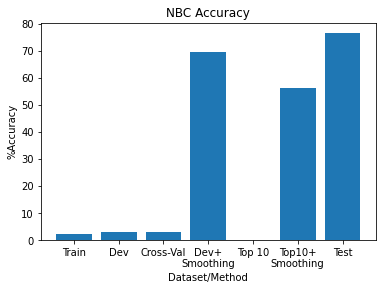

# Introduction

The goal of this assignment is to learn about Naive Bayes Classifiers by building a classifier and training and testing it on an IMDB dataset with the goal of predicting whether a given review's sentiment is "Positive" or "Negative".

**Naive Bayes** is a simple, fast, and accurate algorithm that works particularly well with natural language processing (NLP), or text classification. In my tests, I used the **Multinomial Naive Bayes** algorithm. It works by taking advantage of probability theory and Bayes' Theorem to classify text. For each piece of input text, the probability of each possible class is calculated and the final classification made based on highest probability.


# Preprocessing

Import IMDB dataset and prepare a data array for later graphing.


```python
##import data file and print some basic stats
file = "imdb_labelled.txt"
data = []
with open(file, 'r') as f:
  for row in f:
    data.append(row)

X = []
y = []

# neg = 0
# pos = 0

# for i in data:
#   if '0' in i:
#     neg+=1
#   elif '1' in i:
#     pos+=1

# print("Negative: %d/%d" %(neg,len(data)))
# print("Positive: %d/%d" %(pos,len(data)))
# print("Total: ", neg+pos)

```

Divide the dataset into train, dev, and test sets. First, the data is shuffled and then divided manually using index numbers. To start, the data was divided in an 80/20 ratio for the initial train and test set. Then, the training set was further divided again in an 80/20, train/dev ratio.

The final sizes for each dataset are as follows:
*   train = 640 items
*   dev = 160 items
*   tets = 200 items


```python
import random

random.seed(1)
random.shuffle(data)
dataLen = range(len(data))

train = []
dev = []
test =[]

for i in range(640):
  train.append(data[i])

for i in range(640, 800):
  dev.append(data[i])

for i in range(800, 1000):
  test.append(data[i])

print("Train Data: %d items" %(len(train)))
print("Dev Data: %d items" %(len(dev)))
print("Test Data: %d items" %(len(test)))
```

    Train Data: 640 items
    Dev Data: 160 items
    Test Data: 200 items
    

# Training

Using regular expressions, the training set of 640 items (lines) is split into two lists based on positive/negative sentiment.


```python
import re

#pos = re.search("1$")
#neg = re.search("0$")

#split trainset into pos + negative using regular expressions
def splitPosNeg(data):
  posStr = []
  negStr = []
  for i in data:
    if re.search("1$", i):
      posStr.append(i)
    elif re.search("0$", i):
      negStr.append(i)
  return posStr, negStr

def printPosNeg(posStr, negStr):
  print("Positive Reviews: %d items" %(len(posStr)))
  print("---------------Sample---------------")
  for i in range(5):
    if(len(posStr[i])>80):
      print("%s... 1" %posStr[i][0:80])
    else:
      print(posStr[i], end='')

  print("\n")

  print("Negative Reviews: %d items" %(len(negStr)))
  print("---------------Sample---------------")
  for i in range(5):
    if(len(negStr[i])>80):
      print("%s... 0" %negStr[i][0:80])
    else:
      print(negStr[i], end='')

posStr, negStr = splitPosNeg(train)
printPosNeg(posStr, negStr)
```

    Positive Reviews: 320 items
    ---------------Sample---------------
    The interplay between Martin and Emilio contains the same wonderful chemistry we... 1
    Still it's quite interesting and entertaining to follow.  	1
    This is one of Peter Watkins most accessible films.  	1
    A film not easily forgotten.  	1
    As a courtroom drama, it's compelling, as an indictment on the American justice ... 1
    
    
    Negative Reviews: 320 items
    ---------------Sample---------------
    The acting is beyond abysmal.  	0
    Lot of holes in the plot: there's nothing about how he became the emperor; nothi... 0
    It was forced, like everything in this movie.  	0
    I understand that it's supposed to be a cheap popcorn comedy, but that doesn't m... 0
    Another thing I didn't really like is when a character got punched in the face, ... 0
    

The positive/negative review lists are further processed into dictionaries of vocabularies.

First, each line in the lists was split into individual words and added to a temporary dictionary. This temporary dictionary was then trimmed to include only words that occur more than 3 times, and are greater than 3 characters in length to help filter out articles like "a", "an", as well as the classifying 1/0. The reasoning behind this was to focus on words that contribute to a sentiment, without filler words in the data. This unfortunately leaves in filler words like "the" or "and", but leaves in potentially important words like "bad".


```python
#trainset vocab list + split into pos/neg

def splitWord(strings, tempDict):
  words = 0
  for line in strings:
    line = line.lower()
    temp = re.findall(r'\w+', line)
    for word in temp:
      words+=1
      if word in tempDict:
        tempDict[word] +=1
      else:
        tempDict[word] = 1
  #print("Total Word Count: ", words)

"""
remove all occurrences < 3, all words 2 characters or less to take care of articles like "a", "an", as well as the classifying 1/0
"""
def trim(strings, tempDict):
  keys = list(tempDict.keys())
  vals = list(tempDict.values())
  newDict = dict()
  count = 0
  for i in range(len(vals)):
    k = keys[i]
    if vals[i] >= 3 and len(k) > 2:
      newDict[k] = vals[i]
      count+=vals[i]
  return newDict, count

def makeVocab(strings):
  tempDict = dict()
  splitWord(strings, tempDict)
  newDict, count = trim(strings, tempDict)
  return newDict, count

print("---------------Positive Vocabulary---------------")
posVocab, posCount = makeVocab(posStr)
print("Words After Trimming: ", posCount)
print("Unique Words: %d\n" %len(posVocab))

print("---------------Negative Vocabulary---------------")
negVocab, negCount = makeVocab(negStr)
print("Words After Trimming: ", negCount)
print("Unique Words: %d\n" %len(negVocab))

print("---------------All Words---------------")
allVocab = {**posVocab, **negVocab}
allCount = posCount+negCount
print("Total Word Count: ", allCount)
print("Unique Words: ", len(allVocab))

# print("Positive:", posVocab)
# print("Negative:", negVocab)
# print("All:", allVocab)  
```

    ---------------Positive Vocabulary---------------
    Words After Trimming:  2436
    Unique Words: 262
    
    ---------------Negative Vocabulary---------------
    Words After Trimming:  2259
    Unique Words: 231
    
    ---------------All Words---------------
    Total Word Count:  4695
    Unique Words:  366
    

P(positive) and P(negative) were calculated by dividing the count of each by the total (trimmed) word count.

Individual P(word|sentiment) were calculated using (#word in class)/(#total word count in sentiment class). A general P(word) was also calculated using (#word/#total word count). All three were stored in new dictionaries.


```python
#get probabilities for P(positive), P(negative) based on trimmed word counts
allCount = posCount+negCount
print("---------------Probabilities---------------")
print("P(positive) = %d/%d = %.5f" %(posCount, allCount, posCount/allCount))
print("P(negative) = %d/%d = %.5f\n" %(negCount, allCount, negCount/allCount))

#get individual P(word|class) and store in dictionary
def getProbs(Dict, PCount):
  keys = list(Dict.keys())
  vals = list(Dict.values())
  newDict = dict()
  for i in range(len(vals)):
    k = keys[i]
    p = vals[i]/PCount
    newDict[k] = p
  return newDict

posProb = getProbs(posVocab, posCount)
negProb = getProbs(negVocab, negCount)
allProb = getProbs(allVocab, allCount)

print("---------------P(word) Sample---------------")
print({k: allProb[k] for k in list(allProb)[:5]}, "\n")

print("---------------P(word|positive) Sample---------------")
print({k: posProb[k] for k in list(posProb)[:5]}, "\n")

print("---------------P(word|negative) Sample---------------")
print({k: negProb[k] for k in list(negProb)[:5]})
```

    ---------------Probabilities---------------
    P(positive) = 2436/4695 = 0.51885
    P(negative) = 2259/4695 = 0.48115
    
    ---------------P(word) Sample---------------
    {'the': 0.05473908413205538, 'martin': 0.0006389776357827476, 'and': 0.022577209797657084, 'wonderful': 0.002981895633652822, 'saw': 0.0010649627263045794} 
    
    ---------------P(word|positive) Sample---------------
    {'the': 0.11986863711001643, 'martin': 0.0012315270935960591, 'and': 0.06609195402298851, 'wonderful': 0.005747126436781609, 'saw': 0.002052545155993432} 
    
    ---------------P(word|negative) Sample---------------
    {'the': 0.11376715360779106, 'acting': 0.007525453740593183, 'lot': 0.0013280212483399733, 'holes': 0.0017706949977866313, 'plot': 0.007082779991146525}
    

# Testing Model with Dev Set

The dev set of 160 items was used for the following:
*   General accuracy testing of the fitted training model
*   Five-fold cross validation to test the general algorithm.
*   Accuracy testing with Laplace smoothing


**General Accuracy Testing**:

Line by line, the process was:
1.   Split into individual words
2.   Determine and save the actual sentiment class
3.   Remove words ≤ 2 characters in order to be consistent with the training data and prevent unnecessary zeroes. 
4.   Calculate a P(positive), P(negative) using the vocabulary and probability dictionaries created earlier.
5.   Compare P(positive) and P(negative), taking the higher value as the predicted class.
6.   Compared the predicted class with the actual class, and add on accordingly to a correct/wrong count.

The final prediction accuracy was then calculated.


```python
# print("---------------Sample Dev Set---------------")
# for i in range(7):
#   print(dev[i], end='')

from random import randrange

def actualClass(line):
  if re.search("1$", line):
    return 1
  elif re.search("0$", line):
    return 0

def splitTrim(line):
  words = []
  temp = re.findall(r'\w+', line)
  #print(temp)
  for i in temp:
    if len(i)>2:
      words.append(i)
  #print(words)
  return words

def naiveBayes(line):
  words = splitTrim(line)
  p_pos = 1
  p_neg = 1
  for word in words:
    if word in posVocab:
      p_pos = posProb[word]*p_pos
    else:
      p_pos = p_pos*0
    if word in negVocab:
      p_neg = negProb[word]*p_neg
    else:
      p_neg = p_neg*0
  if p_pos > p_neg:
    pred = 1
  elif p_neg > p_pos:
    pred = 0
  else:
    pred = 2
  return pred

def predict(data):
  correct = 0
  total = 0
  for line in data:
    #print(line)
    actual = actualClass(line)
    pred = naiveBayes(line)
    if pred == actual:
      correct+=1
      total+=1
    else:
      total+=1
  acc = correct/total
  return acc, correct, total

##train on train set just for comparison
accu, correct, total = predict(train)
X.append("Train")
y.append(accu*100)

accu, correct, total = predict(dev)
print("Accuracy: %d/%d = %.2f" %(correct, total, accu*100),"%")
X.append("Dev")
y.append(accu*100)
```

    Accuracy: 5/160 = 3.12 %
    

**Five-Fold Cross Validation**

This tests the algorithm using cross validation. The process is as follows:
1.   Split the data into 5 groups
2.   For each group, use it as a test set with the remaining groups as training sets
3.   Fit a model on the training set and evaluate on the test set
4.   Repeat the above until all samples have had a turn as a test set
5.   Find the mean accuracy


```python
from random import randrange

random.seed(1)

def x_naiveBayes(line):
  words = splitTrim(line)
  p_pos = 1
  p_neg = 1
  for word in words:
    if word in posVocab:
      p_pos = posProb[word]*p_pos
    else:
      p_pos = p_pos*0
    if word in negVocab:
      p_neg = negProb[word]*p_neg
    else:
      p_neg = p_neg*0
  if p_pos > p_neg:
    pred = 1
  elif p_neg > p_pos:
    pred = 0
  else:
    pred = 2
  return pred

def x_predict(data):
  correct = 0
  total = 0
  for line in data:
    #print(line)
    actual = actualClass(line)
    pred = x_naiveBayes(line)
    if pred == actual:
      correct+=1
      total+=1
    else:
      total+=1
  acc = correct/total
  return acc, correct, total

#split dataset into 5 folds
def crossValsplit(dataset):
  folds = 5
  data_split = list()
  data_copy = list(dataset)
  fold_size = int(len(dataset)/folds)
  for i in range(folds):
    fold = list()
    while len(fold) < fold_size:
      index = randrange(len(data_copy))
      fold.append(data_copy.pop(index))
    data_split.append(fold)
  return data_split

def evaluate(data):
  folds = crossValsplit(data)
  scores = list()
  for fold in folds:
    train = list(folds)
    train.remove(fold)
    train = sum(train, [])
    test = list()
    for row in fold:
      test.append(row)
    #create new dictionaries based on fold
    x_posStr, x_negStr = splitPosNeg(train)
    x_posVocab, x_posCount = makeVocab(x_posStr)
    x_negVocab, x_negCount = makeVocab(x_negStr)
    x_allVocab = {**x_posVocab, **x_negVocab}
    x_allCount = x_posCount+x_negCount
    x_posProb = getProbs(x_posVocab, x_posCount)
    x_negProb = getProbs(x_negVocab, x_negCount)
    x_allProb = getProbs(x_allVocab, x_allCount)
    acc, correct, total = x_predict(test)
    acc = acc*100
    scores.append(acc)
  print("Scores: %s" %scores)
  print('Mean Accuracy: %.3f%%' % (sum(scores)/float(len(scores))))
  X.append("Cross-Val")
  y.append(sum(scores)/float(len(scores)))
    
evaluate(dev)
```

    Scores: [6.25, 3.125, 3.125, 3.125, 0.0]
    Mean Accuracy: 3.125%
    

Based on the mean accuracy from cross validation, the current algorithm is not very good and needs refinement before it can be tested against the test dataset.

# Experiments

**Laplace Smoothing**

One major issue that Naive Bayes faces in text classification is missing data. When a word does not appear in a class, making P(word|class) = 0, that probability gets multiplied out to all the other probabilities in determining P(class), making P(class) = 0.

Laplace smoothing is a method of combatting this issue. The process is:
1.   Add 1 to every count so P(word|class) will always > 0.
2.   Balance this by adding the number of possible words to the divisor so the result will never < 1.

Smoothing is applied to the training set of 640 below, adding 1 to every unique word count and total words to #positive and #negative.


```python
def trim(strings, tempDict):
  keys = list(tempDict.keys())
  vals = list(tempDict.values())
  newDict = dict()
  count = 0
  for i in range(len(vals)):
    k = keys[i]
    if vals[i] >= 3 and len(k) > 2:
      #smoothing: unique count + 1
      newDict[k] = vals[i]+1
      count+=vals[i]
  return newDict, count

def makeVocab(strings):
  tempDict = dict()
  splitWord(strings, tempDict)
  newDict, count = trim(strings, tempDict)
  return newDict, count

posVocab, posCount = makeVocab(posStr)
negVocab, negCount = makeVocab(negStr)

allVocab = {**posVocab, **negVocab}

#laplace smoothing
posCount+=len(allVocab)
negCount+=len(allVocab)
allCount = posCount+negCount
#for test words of P=0
noPos = 1/posCount
noNeg = 1/negCount

def getProbs(Dict, PCount):
  keys = list(Dict.keys())
  vals = list(Dict.values())
  newDict = dict()
  for i in range(len(vals)):
    k = keys[i]
    p = vals[i]/PCount
    newDict[k] = p
  return newDict

posProb = getProbs(posVocab, posCount)
negProb = getProbs(negVocab, negCount)
allProb = getProbs(allVocab, allCount)

from random import randrange

def actualClass(line):
  if re.search("1$", line):
    return 1
  elif re.search("0$", line):
    return 0

def splitTrim(line):
  words = []
  temp = re.findall(r'\w+', line)
  #print(temp)
  for i in temp:
    if len(i)>2:
      words.append(i)
  #print(words)
  return words

def naiveBayes(line):
  words = splitTrim(line)
  p_pos = 1
  p_neg = 1
  for word in words:
    if word in posVocab:
      p_pos = posProb[word]*p_pos
    else:
      p_pos = p_pos*noPos
    if word in negVocab:
      p_neg = negProb[word]*p_neg
    else:
      p_neg = p_neg*noNeg
  if p_pos > p_neg:
    pred = 1
  elif p_neg > p_pos:
    pred = 0
  return pred

def predict(data):
  correct = 0
  total = 0
  for line in data:
    #print(line)
    actual = actualClass(line)
    pred = naiveBayes(line)
    if pred == actual:
      correct+=1
      total+=1
    else:
      total+=1
  acc = correct/total
  return acc, correct, total

acc, correct, total = predict(dev)
acc = acc*100
print("Accuracy (Dev set with Smoothing): %d/%d = %.2f" %(correct, total, acc),"%")
X.append("Dev+\nSmoothing")
y.append(acc)
```

    Accuracy (Dev set with Smoothing): 111/160 = 69.38 %
    

Applying smoothing dramatically improved the predictions' accuracy.

**Top Words**

Next, I will derive the top 10 words for predicting class, ie. the top 10 each of P(Positive|word) and P(Negative|word). Given that:

$P(class|word)=\frac{P(word|class)P(class)}{P(word)}$

and I already have the values for P(word), P(class), and P(word|class), this will be a simple matter of finding the top 10 values.


```python
"""
Find the top ten P(class|word) for each class
"""
def topTen(classDict, classCount):
  words = []
  probs = []
  #keys = word, vals = P(word|class)
  keys = list(classDict.keys())
  vals = list(classDict.values())
  pClass = classCount/allCount
  for i in range(len(keys)):
    pWord = allProb[(keys[i])]
    p = (vals[i]*pClass)/pWord
    words.append(keys[i])
    probs.append(p)
  top = sorted(range(len(probs)), key=lambda i: probs[i])[-10:]
  topWords = []
  for i in top:
    topWords.append(words[i])
  return topWords

topPos = topTen(posProb, posCount)
topNeg = topTen(negProb, negCount)

print("Top Positive Words:")
print(topPos)
print("\nTop Negative Words:")
print(topNeg)


```

    Top Positive Words:
    ['has', 'music', 'drama', 'characters', 'other', 'end', 'most', 'people', 'had', 'good']
    
    Top Negative Words:
    ['probably', 'every', 'too', 'annoying', 'wasted', 'had', 'absolutely', 'half', 'fails', 'anyone']
    

Using the above results, I will recalculate P(word|positive) and P(word|negative) based on these top words. Running the algorithm through the dev set again, I checked only to see if the review contained the above words; any other words would not affect probability.


```python
from random import randrange

def actualClass(line):
  if re.search("1$", line):
    return 1
  elif re.search("0$", line):
    return 0

def splitTrim(line):
  words = []
  temp = re.findall(r'\w+', line)
  #print(temp)
  for i in temp:
    if len(i)>2:
      words.append(i)
  #print(words)
  return words

def naiveBayes(line):
  words = splitTrim(line)
  p_pos = 1
  p_neg = 1
  for word in words:
    if word in topPos:
      #print(word)
      p_pos = posProb[word]*p_pos
    else:
      p_pos = p_pos*0
    if word in topNeg:
      p_neg = negProb[word]*p_neg
    else:
      p_neg = p_neg*0
  if p_pos > p_neg:
    pred = 1
  elif p_neg > p_pos:
    pred = 0
  else:
    pred = 2
  return pred

def predict(data):
  correct = 0
  total = 0
  for line in data:
    #print(line)
    actual = actualClass(line)
    pred = naiveBayes(line)
    if pred == actual:
      correct+=1
      total+=1
    else:
      total+=1
  acc = correct/total
  return acc, correct, total

acc, correct, total = predict(dev)
print("Accuracy: %d/%d = %.2f" %(correct, total, acc*100),"%")
X.append("Top 10")
y.append(0)


```

    Accuracy: 0/160 = 0.00 %
    

This did not work at all. Next, I combined top 10 words with Laplace smoothing.


```python
"""
Find the top ten P(class|word) for each class
"""
def topTen(classDict, classCount):
  words = []
  probs = []
  #keys = word, vals = P(word|class)
  keys = list(classDict.keys())
  vals = list(classDict.values())
  pClass = classCount/allCount
  for i in range(len(keys)):
    pWord = allProb[(keys[i])]
    p = (vals[i]*pClass)/pWord
    words.append(keys[i])
    probs.append(p)
  top = sorted(range(len(probs)), key=lambda i: probs[i])[-10:]
  topWords = []
  for i in top:
    topWords.append(words[i])
  return topWords

topPos = topTen(posProb, posCount)
topNeg = topTen(negProb, negCount)

print("Top Positive Words:")
print(topPos)
print("\nTop Negative Words:")
print(topNeg)
```

    Top Positive Words:
    ['has', 'music', 'drama', 'characters', 'other', 'end', 'most', 'people', 'had', 'good']
    
    Top Negative Words:
    ['probably', 'every', 'too', 'annoying', 'wasted', 'had', 'absolutely', 'half', 'fails', 'anyone']
    


```python
from random import randrange

def actualClass(line):
  if re.search("1$", line):
    return 1
  elif re.search("0$", line):
    return 0

def splitTrim(line):
  words = []
  temp = re.findall(r'\w+', line)
  #print(temp)
  for i in temp:
    if len(i)>2:
      words.append(i)
  #print(words)
  return words

#using laplace where noPos and noNeg = 1/classCount
#using top word lists instead of the vocab dictionaries
def naiveBayes(line):
  words = splitTrim(line)
  p_pos = 1
  p_neg = 1
  for word in words:
    if word in topPos:
      p_pos = posProb[word]*p_pos
    else:
      p_pos = p_pos*noPos
    if word in topNeg:
      p_neg = negProb[word]*p_neg
    else:
      p_neg = p_neg*noNeg
  if p_pos > p_neg:
    pred = 1
  elif p_neg > p_pos:
    pred = 0
  return pred

def predict(data):
  correct = 0
  total = 0
  for line in data:
    #print(line)
    actual = actualClass(line)
    pred = naiveBayes(line)
    if pred == actual:
      correct+=1
      total+=1
    else:
      total+=1
  acc = correct/total
  return acc, correct, total

acc, correct, total = predict(dev)
acc = acc*100
print("Accuracy: %d/%d = %.2f" %(correct, total, acc),"%")
X.append("Top10+\nSmoothing")
y.append(acc)
```

    Accuracy: 90/160 = 56.25 %
    

This is much improved, but still not as good as using smoothing without a focus on certain words.

# Testing

Finally, I will calculate the final accuracy. Based on the experiments above, using Laplace smoothing by itself provided the best accuracy, so that will be the approach I use here.


```python
from random import randrange

def actualClass(line):
  if re.search("1$", line):
    return 1
  elif re.search("0$", line):
    return 0

def splitTrim(line):
  words = []
  temp = re.findall(r'\w+', line)
  #print(temp)
  for i in temp:
    if len(i)>2:
      words.append(i)
  #print(words)
  return words

#using laplace where noPos and noNeg = 1/classCount
def naiveBayes(line):
  words = splitTrim(line)
  p_pos = 1
  p_neg = 1
  for word in words:
    if word in posVocab:
      p_pos = posProb[word]*p_pos
    else:
      p_pos = p_pos*noPos
    if word in negVocab:
      p_neg = negProb[word]*p_neg
    else:
      p_neg = p_neg*noNeg
  if p_pos > p_neg:
    pred = 1
  elif p_neg > p_pos:
    pred = 0
  return pred

def predict(data):
  correct = 0
  total = 0
  for line in data:
    #print(line)
    actual = actualClass(line)
    pred = naiveBayes(line)
    if pred == actual:
      correct+=1
      total+=1
    else:
      total+=1
  acc = correct/total
  return acc, correct, total

acc, correct, total = predict(test)
acc = acc*100
print("Accuracy: %d/%d = %.2f" %(correct, total, acc),"%")
X.append("Test")
y.append(acc)
```

    Accuracy: 153/200 = 76.50 %
    


```python
import matplotlib.pyplot as plt

plt.bar(X,y)
plt.title("NBC Accuracy")
plt.xlabel("Dataset/Method")
plt.ylabel("%Accuracy")
plt.show()
```





This has resulted in the highest accuracy of all the tests at 76.50%

# Analysis

In all the tests, only the ones that made use of Laplace smoothing had accuracies > 50%. This clearly shows one of the limitations of this particular algorithm: unknown and unaccounted-for data will have their probabilities of zero multiply out, rendering many classification attempts useless. However, by simply incorporating smoothing, this issue is largely resolved.

**Future Possibilities**

In my tests, I used certain trimming methods on the datasets (frequency > 3, word length > 2 characters). Other possible tests could experiment with different values of the two. Alternatively, instead of setting a frequency/length minimum, I could just import a list of stopwords such as that available from Natural Language Toolkit's [corpus](https://pythonprogramming.net/stop-words-nltk-tutorial/) and remove any stopwords from the datasets.

# References

*   Bruno Stecanella, "A practical explanation of a Naive Bayes classifier", https://monkeylearn.com/blog/practical-explanation-naive-bayes-classifier/
*   Jason Brownlee, "Naive Bayes Classifier From Scratch in Python
", https://machinelearningmastery.com/naive-bayes-classifier-scratch-python/


